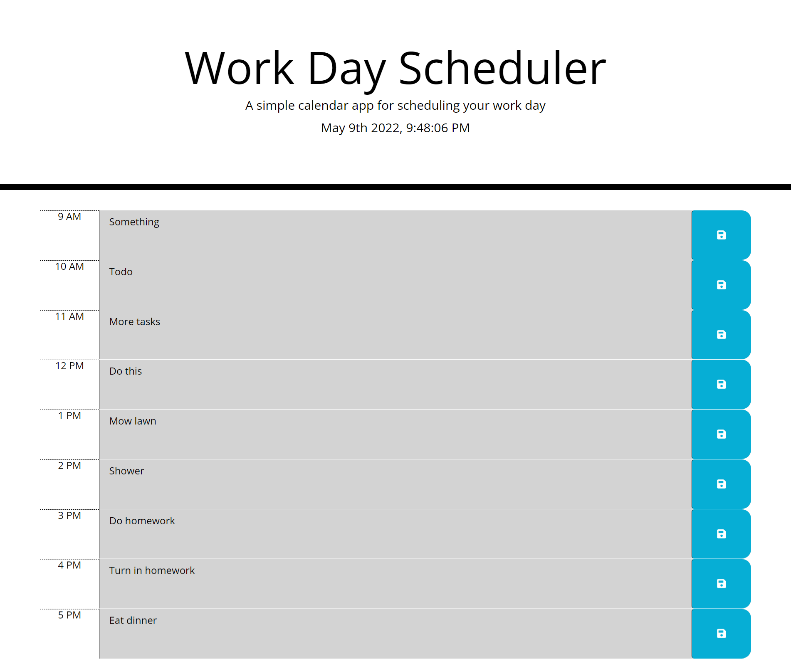

# README

# DESCRIPTION

This is a workday scheduler on which you can write a task and save the task by clicking the save icon. It utilizes a local storage so that when you refresh the page it keeps your tasks. It also tells you past present and future tasks, past being grey, present being red, and future being green.

</img>

https://otterpop7.github.io/super-disco/
